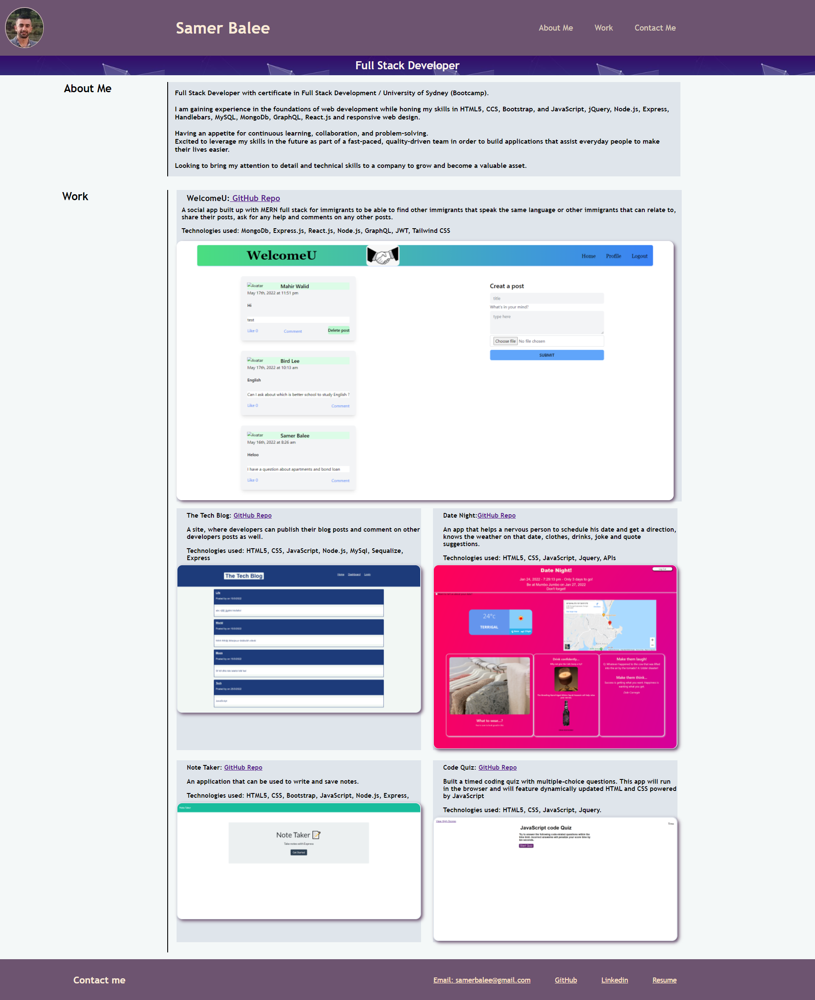

# My-Portfolio

## About the project

As a Developers we need create a  portfolio of work that can showcase our skills and talents to employers looking to fill a part-time or full-time position. An effective portfolio highlights your strongest work as well as the thought processes behind it.

## Description

We need to build a portfolio from scratch by:

1- Create a new repository in GirHub with README file.

2- Open your repository in your local machine, add your files (html, css, images).

3- Start to build you html code for the structure of your portfolio.

4- Start to style your portfolio by applying: flexbox, media queries, and CSS variables.

## Instalation

Please use this link to view my Portfolio [Portfolio](https://samer-balee.github.io/My-Portfolio/)

Please use the following link to view the web page (https://github.com/Samer-Balee/My-Portfolio)
 

## Usage

- Screenshot for my Portfolio page 
  
   

